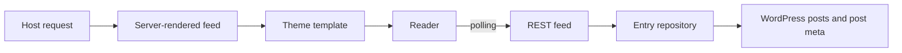

# Blogging Live

Blogging Live is a portable WordPress plugin for publishing fast-moving event coverage as a structured stream of individual updates.

It provides the reusable parts of a liveblog system—content modeling, editorial tools, server rendering, a REST feed, polling, caching, and extension contracts—while leaving publisher-specific advertising, analytics, notifications, identity systems, and delivery infrastructure to integrations.

## Why this approach

Blogging Live uses WordPress posts and post relationships instead of introducing a separate content platform or custom database tables.

```text
Public host post
└── blogging_live container
    ├── blogging_live_entry
    ├── blogging_live_entry
    └── blogging_live_entry
```

- The **host post** is the public article, page, or custom post type readers visit.
- The **liveblog container** is a child of the host and stores event-level state such as status, dates, display order, polling interval, and last-updated time.
- Each **update** is a child of the container and uses the normal block editor, authors, revisions, publication status, timestamps, and featured image support.

This model keeps the host URL canonical, gives every update a complete editorial lifecycle, works with familiar WordPress APIs, and avoids coupling the plugin to a particular theme or hosting platform.

## Highlights

- Host → container → entry parent/child architecture
- Block-editor workflow for individual updates
- Scheduled, live, and ended event states
- Automatic placement, dynamic block, and shortcode rendering
- Server-rendered initial output with progressive JavaScript enhancement
- Cursor-based REST pagination for stable polling and historical loading
- Generation-based object-cache invalidation
- Theme-overridable container and entry templates
- Registered metadata and granular WordPress capabilities
- `LiveBlogPosting` structured data on public host pages
- Documented hooks for notifications, CDN purges, alternate transports, author providers, advertising, and analytics
- No custom database tables and no required third-party services

## Requirements

- WordPress 6.5 or newer
- PHP 8.1 or newer
- A theme that renders post content through `the_content()` when using automatic placement

## Installation

### From GitHub

Clone the repository into the WordPress plugins directory and activate it:

```bash
cd wp-content/plugins
git clone https://github.com/alansmodic/blogging-live.git
wp plugin activate blogging-live
```

You can also download the repository as a ZIP, upload it through **Plugins → Add Plugin → Upload Plugin**, and activate **Blogging Live**.

### First liveblog

1. Edit a public post, page, or supported custom post type.
2. Select **Enable liveblogging for this content** in the Liveblog panel and save.
3. Choose **Manage liveblog** to set the event status, coverage dates, display order, and polling interval.
4. Choose **Add update** to create entries in the block editor.
5. Publish entries as coverage develops.

The feed is appended to enabled host content by default. Turn off automatic placement under **Liveblogs → Settings** when using the block or shortcode instead.

## Rendering and delivery

The first page of entries is rendered in PHP, so the feed remains readable and indexable without JavaScript. The browser script progressively adds:

- polling while the event status is `live`;
- a notification when newer entries are available;
- on-demand loading of older entries;
- DOM events that integrations can observe.

The public delivery flow is deliberately layered:



### Placement options

Automatic placement is enabled by default. For explicit placement, insert the **Blogging Live** block or use a shortcode:

```text
[blogging-live]
[blogging-live id="123"]
[blogging-live post_id="456" show_header="false"]
```

A block or shortcode without a container ID resolves the liveblog attached to the current host post.

## REST API

```text
GET /wp-json/blogging-live/v1/liveblogs/{id}
GET /wp-json/blogging-live/v1/liveblogs/{id}/entries
GET /wp-json/blogging-live/v1/posts/{post_id}/liveblog
```

Entry feed parameters:

- `per_page`: return 1–50 entries;
- `before`: return entries older than the supplied cursor;
- `after`: return entries newer than the supplied cursor.

Cursors combine an entry's publication time and post ID. This avoids the gaps and duplicate results that offset pagination can produce while new entries are being published.

Feed responses contain normalized entry data and rendered HTML, allowing the default reader and alternative front ends to consume the same contract. Public responses receive short cache headers; private and draft liveblogs require an authenticated user who can read the container and return `private, no-store`.

## Architecture

The plugin is composed as a small set of features coordinated by `BloggingLive\Plugin`:

| Area | Responsibility |
| --- | --- |
| `PostTypes` | Registers liveblog containers and update post types |
| `Metadata` | Registers host, container, and entry metadata |
| `Capabilities` | Installs and removes editorial capabilities |
| `Admin` | Adds editorial panels, save handlers, and list-table columns |
| `Lifecycle` | Reacts to entry and host changes, updates timestamps, and invalidates caches |
| `EntryRepository` | Queries ordered entry feeds and manages cursors |
| `LiveblogRepository` | Resolves and creates host/container relationships |
| `Frontend` | Coordinates server rendering, automatic placement, and shortcodes |
| `Blocks` | Registers the dynamic Blogging Live block |
| `RestApi` | Exposes containers and cursor-paginated entries |
| `Cache` | Maintains generation-based object-cache keys |
| `Seo` | Outputs `LiveBlogPosting` JSON-LD for public coverage |

Features depend on WordPress interfaces and explicit repositories rather than global publisher services. The result is a base plugin that can be adopted as-is or extended by a theme, companion plugin, CDN adapter, or real-time transport.

## Templates and styling

Copy either template into the active theme to override its markup:

```text
your-theme/blogging-live/blogging-live.php
your-theme/blogging-live/entry.php
```

Templates receive the normalized data used by the REST API. Default CSS uses `blogging-live` and `blogging-live-entry` class prefixes so a theme can safely restyle the output.

## Extension points

Hooks are documented in [`docs/hooks.md`](docs/hooks.md). Common integration points include:

- alternate or multiple-author providers;
- advertisements or related links between updates;
- push notifications after publication;
- CDN and full-page-cache purging;
- WebSocket or server-sent-event transports;
- sports, election, or event-specific metadata;
- analytics attached to new-entry browser events.

The browser emits:

```text
blogging-live:entries-added
blogging-live:error
```

Use `blogging_live_cache_invalidated` to connect edge-cache purging, and filter `blogging_live_schema` when another SEO system owns the page's structured data.

## Caching behavior

Entry queries use generation-based object-cache keys. Publishing, editing, unpublishing, or deleting an entry increments the parent container's generation. New requests immediately move to a fresh cache namespace while old keys expire naturally.

This keeps invalidation deterministic without requiring a particular persistent object cache, CDN, or hosting provider.

## Data retention

Deactivation preserves all settings and editorial content. Uninstall removes plugin settings and role capabilities but deliberately preserves host metadata, liveblog containers, and entries. Export or explicitly delete coverage before permanent removal when content retention is not desired.

## Initial release: 1.0.0

The first release establishes the complete base architecture:

- native host, container, and entry content model;
- editorial panels, event settings, capabilities, revisions, and block-editor entry support;
- server-rendered output with theme overrides;
- automatic placement, dynamic block, and shortcode;
- cursor-based REST endpoints and progressively enhanced polling;
- generation-based cache invalidation and extension hooks;
- `LiveBlogPosting` structured data;
- WordPress coding-standard configuration and data-model integration tests.

See [`CHANGELOG.md`](CHANGELOG.md) for the concise release history.

## Development

Install development dependencies and run the available checks:

```bash
composer install
composer lint
composer test
```

The PHPUnit suite expects the standard WordPress test library through `WP_TESTS_DIR`:

```bash
WP_TESTS_DIR=/path/to/wordpress-tests-lib composer test
```

The plugin follows WordPress security conventions: registered and sanitized metadata, nonce-protected editorial saves, capability checks, escaped templates, and permission callbacks on REST routes.

## License

Blogging Live is licensed under GPL-2.0-or-later.
